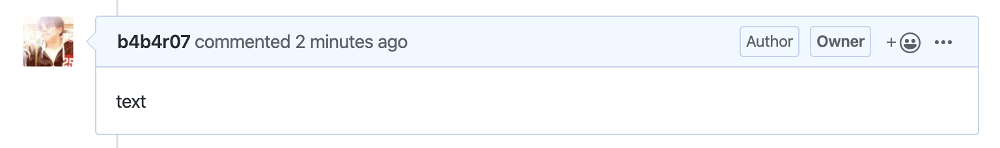

github-comment
==============

Post a text to GitHub issue / pull request



**Notes**: this tool is fork of [tcnksm/misc](https://github.com/tcnksm/misc/tree/master/cmd/github-comment).

## Usage

```console
$ LOG=info ./github-comment --repository="b4b4r07/lab-for-github-actions" --number=19 --body="text"
2020/02/13 01:53:05 [INFO] Version: unset (unset)
2020/02/13 01:53:05 [INFO] Args: []string{"--repository=b4b4r07/lab-for-github-actions", "--number=19", "--body=text"}
2020/02/13 01:53:07 [INFO] Successfully created a comment!
2020/02/13 01:53:07 [INFO] finish main function
```

## Installation

Download the binary from [GitHub Releases][release] and drop it in your `$PATH`.

- [Darwin / Mac][release]
- [Linux][release]

## License

[MIT][license]

[release]: https://github.com/b4b4r07/github-comment/releases/latest
[license]: https://b4b4r07.mit-license.org
